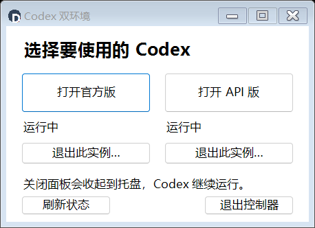
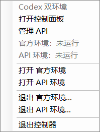

# Codex 双环境 · Windows 部署与实例控制器

**0.2.0**。为官方订阅环境与 API 环境提供独立部署、启动/定位、托盘控制和单独退出入口。源码与发布附件均可审阅；下载请见 [v0.2.0 Release](https://github.com/hc568871650-commits/codex-desktop-dual-environment/releases/tag/v0.2.0)。

**配置与历史隔离不是安全沙箱。** 两边仍可访问同一 Windows 用户能访问的文件。并行修改代码请使用不同目录或 Git worktree。

## 从 0.1 升级

推荐下载升级包，解压到新目录后运行 **Upgrade.cmd**，选择原工具目录。也支持将 0.2 完整包覆盖解压到旧目录，再双击 **Start.cmd** 自动接续旧配置，不必重填密钥。操作前仅退出启动器/控制器，Codex 可继续运行。详细步骤和两种方式的回滚区别见[升级指南](docs/UPGRADE.md)。

## 快速开始

要求：Windows x64、系统自带的 **64 位 Windows PowerShell 5.1 + .NET Framework / WinForms**、已安装的 Codex Desktop。无需 Node、Python 或额外 SDK。ARM64/32 位进程识别未支持；身份读取受限时停止操作。

1. 完整解压工具到固定目录，双击 `Install.cmd`。
2. 输入现有官方 `CODEX_HOME` 的绝对路径、API 地址、模型 ID 和密钥。密钥隐藏输入，使用当前 Windows 用户 DPAPI 加密。
3. 默认工具装入 `%LOCALAPPDATA%\CodexDualController`，新 API 数据装入 `%LOCALAPPDATA%\CodexDualData\API`。官方数据保持原位，默认沿用原生 Desktop profile，不复制官方认证或历史。
4. 使用生成的 **Codex Dual Controller**（控制面板）、**Codex Official**（官方版）、**Codex API**（API 版）快捷方式。安装过程不启动或关闭 Codex。
5. 打开“Codex 双环境控制器”小面板，点击官方版/API版。可右键安装目录的 `CodexDualController.exe` 选择“固定到任务栏”；之后点击固定图标即可找回面板。托盘也可以选择“启动或显示”。已运行时定位已有窗口；多个主窗口时选择；未运行时才启动。

已有官方 `config.toml` 必须具有可解析的 `[desktop] projectlessWorkspaceRoot`；安装器读取该设置并保留它，缺失时提示手动设置，不静默改写原配置。没有任何数据的全新官方目录才会生成最小配置。





截图来自本机两个独立测试实例运行时实际渲染的菜单；不是任务状态面板。

可指定部署位置、官方 profile、安装目录或桌面程序路径：

```powershell
powershell.exe -NoProfile -STA -ExecutionPolicy Bypass -File scripts\Install.ps1 `
  -InstallDirectory 'C:\CodexDual\Tool' -DataDirectory 'C:\CodexDual\Data' `
  -OfficialHome 'C:\MyCodexHome' -Executable 'C:\InstalledCodex'
```

不要把密钥写进命令行；留空由安装器交互安全询问。示例路径仅是占位，工具没有内置个人路径、服务商、PID 或 Codex 版本号。Store 程序每次动态查询；其他安装方式需指定目录或 EXE（由用户确认是桌面版，不是 CLI）。

## 已有双环境

使用 [Register-Existing.ps1](scripts/Register-Existing.ps1) 生成单独控制配置；原 API 启动器仍负责凭据加载。这个流程只记录路径，不读取认证、复制历史或改写原环境。

```powershell
.\scripts\Register-Existing.ps1 `
  -OfficialHome 'C:\ExistingOfficial\Home' -OfficialProjects 'C:\ExistingOfficial\Projects' `
  -OfficialProjectless 'C:\ExistingOfficial\Projectless' `
  -ApiRoot 'C:\ExistingAPI' -ApiLauncher 'C:\ExistingAPI\Launcher\Start-API.ps1' `
  -ConfigPath 'C:\CodexDual\Control\instances.local.json'
.\Controller.cmd -ConfigPath 'C:\CodexDual\Control\instances.local.json'
```

注册采用 API 根目录下 `CodexHome / DesktopProfile / Projects / Projectless` 约定。若原结构不同，可按[配置模板](config/instances.example.json)调整。外部启动脚本仅在确认未运行时执行，控制器不改写它；脚本的全局副作用需要自行审阅。`Configure.cmd` 保留旧版 API 配置界面，启动按钮已禁用，统一从控制器启动。

## 实例控制规则

- 每个实例有稳定 UUID，保存 home、profile、项目目录、无项目目录及启动方式。
- 进程识别结合完整 EXE 路径、解析后的 profile、只读 `CODEX_HOME`、PID 和创建时间。运行记录不含密钥、命令行或窗口标题。重启控制器后从进程重新识别，不信任失效 PID。
- 未知归属、同 profile 不同 home、多个主进程、路径缺失时拒绝操作。无 profile 参数本身不代表官方版。
- 每个环境独立操作锁；控制器每个 Windows 用户会话仅运行一份。退出控制器不退出 Codex。
- Store 版先通过原生单实例入口唤起，随后仅聚焦应用已显示的主窗口；不强制显示隐藏窗口。Windows 可以拒绝抢占前台，此时明确提示；不会操作另一个实例凑出“成功”。原窗口已销毁时报告无可恢复窗口，不重复启动。
- 退出先提醒检查任务，再向该实例所有主窗口发送正常关闭请求。仍驻留时单独询问是否强制结束，默认否。
- 强制结束只处理身份再次通过核验的主进程及同 EXE 的桌面子进程，持有进程句柄并再核对创建时间以防 PID 复用。不会按 `ChatGPT.exe`/`codex.exe` 名称批量终止。
- 无法充分确认的 app-server、终端、服务器和编辑器不强杀，残留报告说明保留的进程。因此“桌面已退出”不等于所有任务外部进程已停止。
- 从某个 Codex 任务里直接调用退出命令时，祖先进程保护会拒绝退出承载该命令的实例。托盘控制器无法判断所有其他窗口的任务状态，必须由用户检查。

## 卸载与回滚

先从托盘退出控制器，然后运行安装目录的 `Uninstall.cmd`。它按安装清单和文件哈希删除新增工具文件、原位置未修改的快捷方式，**保留两套数据、凭据、本机配置和修改过的文件**。不修改系统环境变量、启动项、协议关联或官方程序包。

### 快捷方式与英文路径

维护版本生成的快捷方式统一使用英文文件名：`Codex Dual Controller.lnk`、`Codex Official.lnk`、`Codex API.lnk`，界面仍为中文。已有环境部署入口也使用 `Codex Dual Controller.lnk`。已发布的 v0.2.0 附件仍使用旧名称，此改动以当前 main 源码为准。

为兼容英文 Windows 等系统，建议快捷方式保存的**完整目录路径**也只包含英文字母、数字、空格及常规路径符号，例如 `D:\CodexDual\Shortcuts`。仅修改 `.lnk` 文件名，不能解决其上级目录含中文时的旧 WScript 接口兼容问题。中文 Windows 上原有中文路径可能正常，不需要因此搬动已经正常使用的环境。

安装器默认仍使用系统实际桌面目录，支持桌面位于 D 盘；需要避开中文桌面路径时，可为安装命令附加 `-ShortcutDirectory 'D:\CodexDual\Shortcuts'`。已有环境部署脚本 `scripts/Deploy-Controller.ps1` 也支持此参数。该参数只指定新快捷方式的位置，不会移动桌面、改名用户目录或更改 Codex 数据路径。安装后可将快捷方式导入收纳软件；移动后的原位置卸载追踪限制见下文。

快捷方式可以移入收纳应用，目标、配置与图标均采用固定绝对路径。移动后卸载器不会扫描寻找它，请手动删除。工具安装目录本身不能随意移动；要更换位置应重新生成快捷方式。

重复安装保留已有配置和密钥。安装中断的新增工具文件有清单可回滚；用户数据即使是此次新建，也保留供检查。卸载后留下的配置不等于仍已安装，重新使用时可从完整解压目录传 `-ConfigPath` 指向它。

历史迁移是[独立可选流程](docs/MIGRATION.md)，不属于默认安装，也没有自动复制认证文件的功能。

## 验证与边界

详见[测试结果](docs/VALIDATION.md)、[设计与故障排查](docs/USAGE.md)、[通知与窗口标识研究](docs/NOTIFICATIONS.md)。

- 原核心 40 项、实例控制 39 项（含真实 WinForms 子进程）、控制器 3 项、安装/卸载 11 项、升级 35 项检查通过。
- 本机 Store Codex **26.903.9818.0** 的两个全新隔离实例已验证同时启动、重复启动去重、进程重新识别和正常关闭后的后台驻留检测。
- 本机真实 Codex 已经用户确认：通过原生单实例入口唤起后，窗口内部点击恢复正常，原进程不变。直接 ShowWindow 唤起已停用。其他版本和多窗口场景仍需补验。
- 真实 API 请求、聊天历史互不串入、任务实际落盘、原生托盘点击和通知任务精准跳转 **未在本轮验证**。测试没有发送任务或使用真实密钥。
- 不展示“空闲/任务完成”，不保证原生托盘、任务栏分组或通知能区分两个实例。不修改官方包，不关闭系统安全功能。

```powershell
powershell.exe -NoProfile -ExecutionPolicy Bypass -File tests\Test-Core.ps1
powershell.exe -NoProfile -ExecutionPolicy Bypass -File tests\Test-Instances.ps1 -Integration
powershell.exe -NoProfile -ExecutionPolicy Bypass -File tests\Test-Install.ps1
powershell.exe -NoProfile -ExecutionPolicy Bypass -File scripts\Build-Release.ps1
```

`tests/Test-Desktop.ps1 -RunIsolatedDesktop` 是显式开启的真实桌面测试，会新建两个无真实凭据的测试实例；正常关闭后如果驻留，不自动强杀。测试产物留在被忽略的 `test-results`。发布包仅选取源码、入口、模板、固定图标和文档，不包含用户运行数据。
