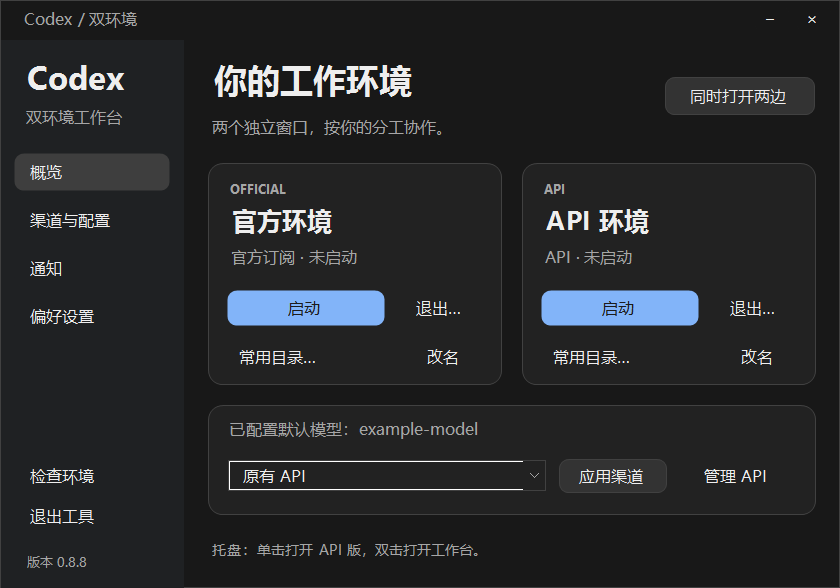
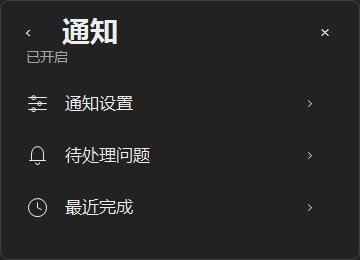
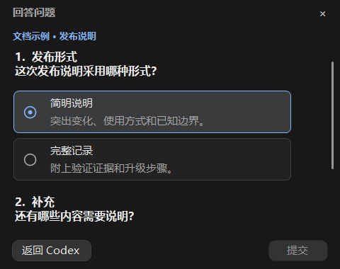
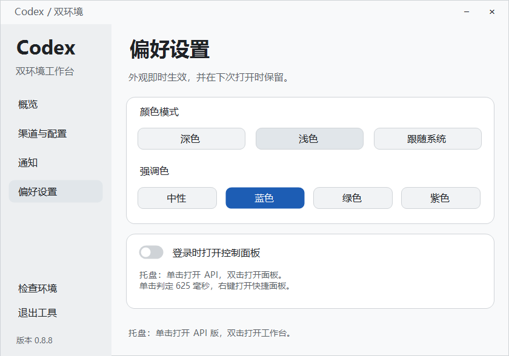

# Codex Desktop 双环境

**在 Windows 上同时使用官方订阅与自选 API，用一个控制器管理两个 Codex Desktop。**

两套 Desktop 可以同时打开，分别使用自己的配置与凭据入口。你负责把任务分给两个窗口；控制器负责启动、找回窗口、管理 API 渠道，以及提供 API 任务提醒。

[公开版下载](https://github.com/hc568871650-commits/codex-desktop-dual-environment/releases/latest) · [快速开始](#快速开始) · [升级指南](docs/UPGRADE.md) · [0.8.8 发布说明](docs/RELEASE-0.8.8.md) · [验证记录](docs/VALIDATION.md)

> **当前版本：v0.8.8。** 本次从公开版 v0.8.3 累计更新，包含 0.8.4–0.8.8 的变化；0.8.4–0.8.7 为本机迭代，未单独公开发布。附件、校验清单与最终发布状态见 [v0.8.8 Release](https://github.com/hc568871650-commits/codex-desktop-dual-environment/releases/tag/v0.8.8)。



*新版真实 WinForms 界面，以独立示例配置渲染；图中未运行状态不表示任务空闲。本文配图不含真实凭据或聊天。*

## 可以做什么

| 日常需要 | 控制器提供的能力 |
|---|---|
| 同时使用官方与 API | 保留官方环境，使用独立 API home、profile 和目录；可同时打开两边 |
| 找回正在运行的窗口 | 先核验实例身份，再定位已有窗口；多个主窗口时选择，不盲目重复启动 |
| 管理 API 接入 | 保存与切换渠道、对接 CC Switch、备份恢复；运行期间切换渠道暂存至下次启动 |
| 减少后台任务等待 | API 任务完成卡片、最近完成列表、点击返回目标任务 |
| 调整日常交互 | 深色/浅色/跟随系统、强调色、窗口位置、聚焦与置顶、自启动 |
| 检查和维护环境 | 常用目录入口、脱敏诊断、安装升级、备份与回滚 |

官方版仍可打开、定位和退出；**自动完成提醒与最近完成列表仅面向已登记的 API 实例**。

独立配置不等于文件沙箱。两个进程仍具有当前 Windows 用户的文件权限；同时修改同一项目时，请使用不同目录或 Git worktree。本工具不会自动分派任务或同步聊天。

## 新版通知与提问体验

### 一张卡片，直接打开

完成提示和待回答提示采用统一布局：短状态、正文和右上角 **×**。点击卡片主体打开任务或问题，点击 × 只关闭提示。同一时刻保留一张提示卡片，完成记录和待处理问题仍可从控制台查看。

| 深色完成提示 | 浅色完成提示 |
|---|---|
|  |  |

API 主窗口在前台时，自动完成提示保持静默，最近完成记录仍更新；切回后台不会补弹旧事件。这里的前台判断针对核验后的 **API 实例**，不是逐个聊天标签页判断。显式预览仍会展示。

通知开关、暂停、恢复和显示设置集中在控制台。托盘的通知页只保留设置、待处理问题与最近完成入口。



### 提问按场景出现，回答确认后收起

**以下真实问答行为需要另外配置并核验提问桥接，标准安装不会自动启用。**

| 场景 | 当前行为 |
|---|---|
| API 窗口在前台 | 新问题保留 Codex 原生作答入口 |
| API 窗口在后台 | 按偏好显示提醒、非聚焦小窗或聚焦小窗 |
| 已接管问题返回前台 | 确认交回原生入口后收起外部界面；不重复提交 |
| 外部回答成功 | 收到成功回执，在同一次界面更新中收起对应窗口和通知 |
| 其他入口已处理、迟到的成功确认 | 下一次有效状态同步后收起；正常轮询间隔约 0.9 秒 |
| 连接失败或结果不明 | 保留作答窗口和草稿，提示状态并禁止不确定的重复提交 |



作答窗支持多题滚动、选项、自由输入和敏感内容遮罩；默认约 480 × 380，可调整大小。关闭窗口不会替你回答或取消问题。预览没有真实提交，所以会保留“答案未发送”的反馈。

**交付边界：**标准 ZIP 包含问题界面、待处理视图和连接客户端，但不包含 `experiments/notification-bridge` 的代理程序、机器绑定或生产安装流程。普通用户可在“通知 → 待处理 → 预览提问”查看界面；维护者可从[桥接实验说明（需检出源码）](https://github.com/hc568871650-commits/codex-desktop-dual-environment/tree/v0.8.8/experiments/notification-bridge)建立独立试验环境。已配置的桥接在身份、程序版本或绑定校验失败时回退原生入口。审批和未知交互继续由 Codex 处理。

## 快速开始

要求：**Windows x64、Windows PowerShell 5.1、.NET Framework / WinForms，以及已安装的 Codex Desktop**。正常安装不需要 Node.js、Python 或额外 SDK；ARM64 与 32 位进程识别未支持。

1. 从公开 Release 下载完整包，解压到新目录，双击 **Start.cmd** 或 **Install.cmd**。
2. 首次安装时填写官方 `CODEX_HOME` 路径、API 地址、模型 ID 和密钥。密钥使用隐藏输入，并由当前 Windows 用户的 DPAPI 加密保存。已有安装走升级流程，复用原配置。
3. 默认控制器安装到 `%LOCALAPPDATA%\CodexDualController`，API 数据位于 `%LOCALAPPDATA%\CodexDualData\API`。官方数据保持原位，不复制其认证和历史；安装过程不启动或关闭 Codex。
4. 使用生成的 **Codex Dual Controller**、**Codex Official**、**Codex API** 快捷方式。面板里分别打开环境，也可以点击“同时打开两边”。
5. 需要时在“管理 API”“通知”“偏好设置”中调整渠道、提醒和窗口行为。自启动默认关闭，可按需开启。

| 入口 | 操作 |
|---|---|
| 托盘单击 | 启动或找回 API 窗口 |
| 托盘双击 / 控制面板快捷方式 | 找回控制面板 |
| 托盘右键 | 打开快捷操作面板 |
| 控制面板 × | 收起到托盘 |
| 退出控制器 | 仅退出控制器，Codex 保持运行 |



安装器需要能解析已有官方配置的 `[desktop] projectlessWorkspaceRoot`。首次安装遇到缺失或复杂写法时会提示处理，不静默重写已有官方配置；升级的兼容规则见[升级指南](docs/UPGRADE.md)。

自定义路径可使用安装入口：

```powershell
powershell.exe -NoProfile -STA -ExecutionPolicy Bypass -File scripts\Bootstrap.ps1 `
  -TargetDirectory 'C:\CodexDual\Tool' -DataDirectory 'C:\CodexDual\Data' `
  -OfficialHome 'C:\MyCodexHome' -Executable 'C:\InstalledCodex'
```

示例路径为占位；不要把密钥写进命令行。Store 版动态查询实际程序路径，其他安装方式可指定 Desktop 目录或 EXE，不能选择 Codex CLI。已有双环境可用 [Register-Existing.ps1](scripts/Register-Existing.ps1) 登记，保留原外部启动器及其凭据管理，详见[操作说明](docs/USAGE.md)。

## 升级、回滚与数据保留

推荐把新包解压到新目录，再运行 **Start.cmd**，让统一入口识别旧安装、备份并升级。只需退出控制器，已有 Codex 任务可以继续运行。多个安装候选时才要求选择；也可用 **Upgrade.cmd** 手动选择工具目录。

- 实例 ID、API 配置、凭据、项目和聊天数据不属于工具覆盖范围。
- 升级备份保存在 `upgrades` 目录，可用 **Rollback.cmd** 选择备份恢复；恢复前核验文件哈希。
- 卸载按清单移除未修改的工具文件和快捷方式，保留用户数据、本机配置及修改过的文件。
- 首次启用或替换提问代理，需要在任务结束后完整退出并重启 API Desktop；重启控制器不会把新代理注入已有进程。沿用代理的普通控制器升级没有这个要求。

完整步骤见[升级指南](docs/UPGRADE.md)。快捷方式可以移入收纳应用，但工具安装目录不应随意搬动；移动后的快捷方式需要手动清理。若旧 WScript 接口遇到中文完整路径兼容问题，可使用 `-ShortcutDirectory 'D:\CodexDual\Shortcuts'` 创建新的英文路径入口，不必搬动数据。

## 实例识别与已知边界

控制器结合完整 EXE 路径、Desktop profile、只读 `CODEX_HOME`、PID 和创建时间确认实例。归属不明时停止操作；不按 `ChatGPT.exe` 或 `codex.exe` 名称批量结束进程。正常退出后仍驻留时，强制结束需要单独确认；不能确认归属的外部任务进程会保留并报告。

Windows 可能拒绝后台抢占前台，控制器会提示实际结果。进程“已运行”不表示任务空闲，也不保证任务已结束。不同 Codex 版本、多窗口导航、历史恢复和全部原生通知类型仍有待覆盖，不能把局部测试视为完全兼容。

0.8.8 发布候选在 Windows PowerShell 5.1 下通过 **29 套控制器回归及 7 套桥接 fixture 检查**，覆盖同步/异步回答、前后台切换和多连接路由；此前的 116 项专项证据继续保留。后台真实日常模型问答、所有窗口/通知组合、精确聊天导航与历史恢复尚未全面验收，实验桥接仍不作为标准包能力交付。最终 CI、附件与验证范围见 [Release](https://github.com/hc568871650-commits/codex-desktop-dual-environment/releases/tag/v0.8.8) 和[验证记录](docs/VALIDATION.md)。

## 开发与版本记录

```powershell
# Windows PowerShell 5.1，逐进程运行控制器测试
powershell.exe -NoProfile -STA -ExecutionPolicy Bypass -File tests\Test-All.ps1

# 从当前控件生成脱敏文档配图，使用独立示例配置
powershell.exe -NoProfile -STA -ExecutionPolicy Bypass -File scripts\Export-DocumentationImages.ps1
```

| 版本 | 主要变化 |
|---|---|
| [0.8.8](docs/VERSION-0.8.8.md) | 成功回答及时收起、延迟确认恢复、连接确认与旧回执隔离 |
| [0.8.7](docs/VERSION-0.8.7.md) | 通知卡片和作答窗精简，通知控制集中 |
| [0.8.6](docs/VERSION-0.8.6.md) | API 前台原生提问、后台独立作答、切换时防重复 |
| [0.8.5](docs/VERSION-0.8.5.md) | 前台完成提示静默、断管异常修复、多连接路由 |
| [0.8.4](docs/VERSION-0.8.4.md) | API 专属提醒、窗口行为、本机桥接绑定 |
| [0.8.3](docs/VERSION-0.8.3.md) | 已公开：通知时长/动画/圆角、紧凑作答与待处理视图 |
| [0.7](docs/VERSION-0.7.md) 及以前 | 主题与通知页、双环境管理、API 渠道、安装升级和诊断 |

历史公开版本有跳跃：0.6.x、0.8.0–0.8.2、0.8.4–0.8.7 未单独公开。历史文档保留当时状态，判断当前能力请从本 README 和最新验证记录进入。

[操作与排错](docs/USAGE.md) · [自动安装](docs/AUTO-SETUP.md) · [可选历史迁移](docs/MIGRATION.md) · [配图来源](docs/images/0.8.8/README.md)
