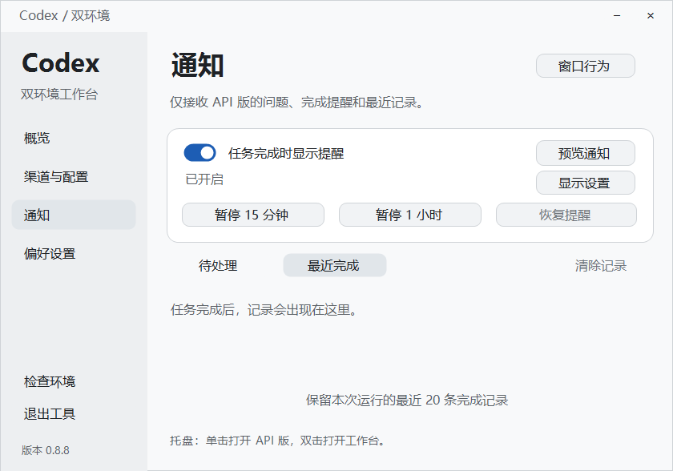
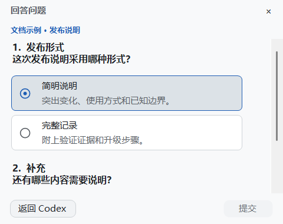

# v0.8.8 · 更简洁的通知与一致的提问体验

本次从公开版 v0.8.3 累计交付 0.8.4–0.8.8 的变化；0.8.4–0.8.7 属于本机迭代，没有分别公开发布。附件及最终状态见 [v0.8.8 Release](https://github.com/hc568871650-commits/codex-desktop-dual-environment/releases/tag/v0.8.8)。0.8.3 之前的基础能力继续保留：官方/API 双环境控制、API 渠道管理、安装升级、回滚、外观与通知设置。

## 标准控制器的变化

**提醒更克制。** 自动完成提醒和最近完成记录仅面向 API 环境。已核验的 API 主窗口处于前台时保持静默；后台事件正常提醒，切回后台不补弹已处理的旧事件。前台判断针对整个 API 实例，不细分当前聊天标签页。

**卡片更简洁。** 完成和待回答提示采用同一套布局：正文直接点击打开，右上角 × 关闭。删除重复操作按钮，按内容调整高度，同一时刻只显示一张卡片；替换提示不会删除完成记录或取消待处理问题。

**设置集中。** 通知开关、暂停与恢复保留在控制台；快捷通知页收紧为三个入口。控制面板和作答窗可分别选择是否聚焦、是否置顶，保留已有主题和显示设置。

**作答后及时收起。** 对已连接的提问服务，成功回执会在同次 UI 更新中收起作答窗和对应通知。其他入口处理或延迟成功确认由下一次有效同步收起；正常轮询间隔约 0.9 秒，不是异常情况下的关闭时限。失败和未知结果保留作答窗口、草稿及提示，避免重复提交。预览不会发送答案，因此保留预览反馈。

配图为当前 WinForms 控件与示例数据；多题内容可滚动，不代表此安装已经启用桥接。[生成方式与来源](images/0.8.8/README.md)。

## 桥接源码与本机验证的变化

这部分需要独立部署、验证与绑定，**不属于标准 ZIP 的开箱即用能力**。

- 支持传统同步问题和异步问题；API 在前台使用原生入口，后台按设置显示外部提醒或作答窗。
- 回到前台时交回原生入口；已经交回的问题不再被夺回，在途答案不制造第二个提交入口。
- 多个 app-server 使用独立管道，待处理列表按连接汇总，答案按连接、请求和轮次路由。
- 修复管道断开时清理阶段的未处理异常，未知异步结构保持原生透传。
- 迟到的旧回执不会关闭新问题；只有目标连接实际确认问题消失才自动收起，缺失连接不会被其他连接的空列表误判。

标准包带有问题窗口和连接客户端，但不包含 `experiments/notification-bridge`、生产代理、机器绑定及生产部署脚本。审批、未知问题结构、未绑定环境继续使用原生流程。首次启用或更换代理需在任务结束后完整重启 API Desktop；仅重启控制器不会改变既有代理链路。

## 升级与回退

发布附件：

- `CodexDualLauncher-0.8.8-windows.zip`：完整包。
- `CodexDualLauncher-0.x-to-0.8.8-upgrade.zip`：工具升级包。
- `SHA256SUMS.txt`：完整包和升级包的 SHA-256 清单。

将新包解压到新目录，退出旧控制器，运行 Start.cmd 自动识别并备份升级。Codex 任务可继续运行。不要把 API 数据目录选作工具目录。需要回滚时运行 Rollback.cmd，选择此次升级备份；文件变更或哈希不符时停止恢复，保留备份处理。详见[升级指南](UPGRADE.md)。

## 验证范围

本次发布候选已通过 29 套控制器回归和 7 套隔离桥接 fixture。CI 已加入 Takeover、ControllerTakeover、MultiConnection，覆盖新增接管协议和多连接检查。最终提交 CI、附件一致性及公开下载核验以 Release 页面记录为准。

两份候选 ZIP 通过 20 项包检查，覆盖完整包全新安装和编译、真实 v0.8.3 公开版升级、面板运行、回滚恢复及配置/凭据保留。8 张新配图随两份包交付，当前指南相对链接在源码及两包内均可达。

以下为开发期间已有的专项与本机证据，不替代本次发布候选验证：

| 证据层 | 已有结果 | 不能替代的检查 |
|---|---|---|
| 0.8.7 控制器回归 | 29 套具有最终通过证据，焦点相关检查由 GUI/STA 宿主补验，原失败日志保留 | 0.8.8 最终提交的完整回归 |
| 0.8.8 针对性回归 | 控制器问答 25、异步接管 32、多连接 30、问题窗口 29，共 116 项通过 | 远端模型及所有真实 Desktop 使用组合 |
| 本机 0.8.8 安装快照 | 129 个文件匹配、通知工作进程运行、既有 API/代理/CLI 及受保护配置保留 | 新发布包的内容、全新安装和公开版升级验收 |
| 前台真实问题 | 当前会话已验证原生问题显示和选择回传 | 所有后台真实问答、多窗口与历史恢复 |

发布包按现有白名单排除实验代理及运行数据。下载后可用 `Get-FileHash -Algorithm SHA256` 对照校验清单。

已知边界：Windows 前台切换可能受系统限制；精确聊天导航与全部原生通知类型未全面验收；两套环境不是文件沙箱。普通问题发送成功也不等于任务最终完成。详见[验证记录](VALIDATION.md)。
