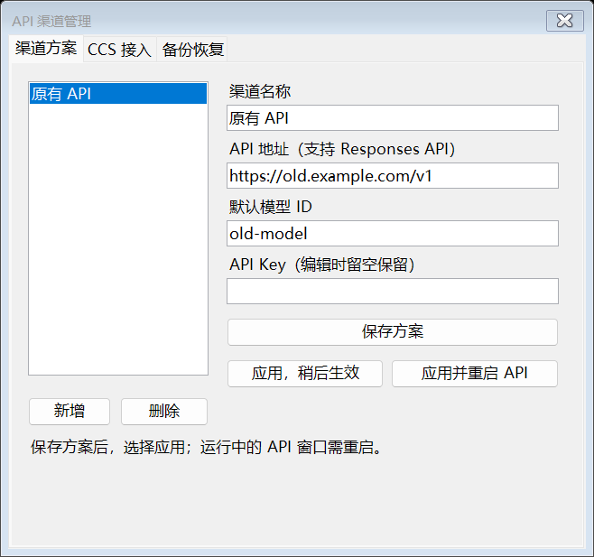

# 0.3.0：双开体验优化

## 面板和名称

托盘左键与固定任务栏入口找回同一个小面板；右键保留快捷菜单。面板失去焦点后保留，拖动结束时保存位置；关闭按钮收起到托盘。下次启动或屏幕布局变化时将位置限制在可见工作区内。

两个环境均有“改名”入口，可填写 1–24 个字符，例如“主力开发”“审查助手”。“恢复默认”只恢复选中环境的名称。面板、菜单和退出提示共用此名称，并保留官方订阅/API 类型标识。名称按稳定实例 ID 保存，重启和升级后保留；不改目录、凭据、快捷方式文件名或 Codex 本体窗口标题。

## API 渠道

本工具安装或从 0.1 升级的 API 环境默认使用内置管理。“管理 API → 渠道方案”自动列出原有配置，无需重新输入原密钥。

1. “新增”填写名称、地址、模型 ID 和密钥，保存方案。编辑已有方案时密钥留空表示保留。
2. 保存方案不改变当前 API 配置。主面板“应用渠道”或管理页“应用，稍后生效”提交选择。
3. API 未运行时，成套应用地址、默认模型和密钥。API 仍在运行时，仅保存选定方案的快照，不改它正在使用的配置或凭据；下次通过控制器启动时自动应用。稍后编辑同名方案不会偷偷改变已暂存的选择，需要再次应用。
4. “应用并重启 API”先走原有退出确认。取消退出或未成功退出时不应用渠道；完成退出后应用并启动。
5. 正在使用或等待应用的渠道不能直接删除，先应用其他渠道。

每个渠道的密钥使用当前 Windows 用户 DPAPI 加密。面板展示的是保存的默认模型；具体任务可能使用自己选择的模型。

保存只更新本工具负责的 TOML 字段，保留 MCP、其他服务商、注释等非受管文本。发现重复键、外部服务商接管、认证冲突、受管字段的内联表等无法可靠编辑的结构时停止，保留原文件。编辑器不是完整 TOML 验证器；支持范围以测试夹具和具体报错为准。

## 和 CC Switch 配合

同一 API 环境只由内置管理或 CCS 其中一方写渠道和凭据。0.3 提供打开 CCS、核对实际目录、交接及恢复入口；供应商选择在 CCS 中完成，不直接改写 CCS 数据库。CCS 的本地代理和协议转换仍由 CCS 自己提供。

1. 在“CCS 接入”选择已安装的 CC Switch EXE；设置文件按默认目录及 CCS 的目录覆盖设置自动检测。
2. 可先“打开 CCS”，将其 Codex 配置目录设置为页面列出的 **API CodexHome**。在交接完成之前不要应用供应商或接管代理，以便控制器能备份完整的内置配置。
3. 点击“检查接入”。目录不一致时不会交接；不会替你修改官方环境或 CCS 的全局路径。
4. 结束 API 任务并退出该实例，点击“交给 CCS 管理”。此时保存加密快照并停用内置编辑；在 CCS 中选择 API 供应商。
5. CCS 写入的 Codex 配置必须保留 `forced_login_method = "api"`、`cli_auth_credentials_store = "file"` 和原 `[desktop] projectlessWorkspaceRoot`。可按 CCS 的共享配置片段功能保留这些字段。控制器启动前会检查认证入口与任务目录；旧启动器占位凭据未被替换时拒绝启动。
6. 如使用 CCS 本地代理，先启动该代理。控制器不保证代理或上游可用，不把配置检查当作真实模型请求成功。
7. 要返回内置管理，先退出 API 实例和 CCS，再点击“恢复内置管理”。恢复交接前的配置、密钥和渠道列表，当前 CCS 配置另存加密快照。CCS 仍记住这个 Codex 目录；以后再次在 CCS 中操作它仍可能改写文件，需要自行解除该目录关联。

CCS 的实验目录、专用启动脚本及非标准启动环境不能直接绑定到正常 CCS EXE；已有 external 启动器实例继续使用原管理工具。本版不自动迁移此类凭据。

## 备份和恢复

应用渠道、交给 CCS 管理前会保存加密快照，也可手动备份。快照同时保存 API 配置、认证入口、加密密钥、模式标记和渠道列表，仅当前 Windows 用户可解密。

恢复前先退出 API 实例，选择快照并确认；恢复前再次自动备份。CCS 管理期间请使用“恢复内置管理”进行交接，避免双方同时写配置。旧版生成的单独 `.toml` 备份仍保留，但新界面的成套恢复只使用 `snapshot-*.local.json`。

## 登录自启动

面板开关默认关闭。开启后为当前配置登记 Windows 当前用户的登录启动项，登录时直接显示控制面板，两个 Codex 窗口仍由用户手动打开。旧版“仅驻留托盘”的登记会在下次打开控制器时自动迁移。无需管理员权限。

关闭开关时移除精确匹配的本工具登记；升级保留选择，卸载移除本安装登记。用户另行改写的同名启动项保留并提示检查。若 Windows 的“启动应用”界面另行禁用了此项，还需在系统设置中开启。

回滚到 0.1 / 0.2 前先关闭 0.3 的自启动开关，旧版 EXE 不理解后台启动参数。

## 安装和升级

完整包：`CodexDualLauncher-0.3.1-windows.zip`。解压后运行 `Start.cmd` 或 `Install.cmd`，自动决定安装、升级、修复或直接打开。仍只依赖 Windows x64 自带的 PowerShell 5.1、.NET Framework 和已安装的 Codex Desktop。

升级包：`CodexDualLauncher-0.x-to-0.3.1-upgrade.zip`。使用相同的统一入口；也保留 `Upgrade.cmd` 手动选择原工具目录。退出旧控制器即可，两套 Codex 可以保持运行。升级保留实例配置、名称、位置、渠道和数据。

完成后从原位置打开控制器。完整步骤见 [UPGRADE.md](UPGRADE.md)。
