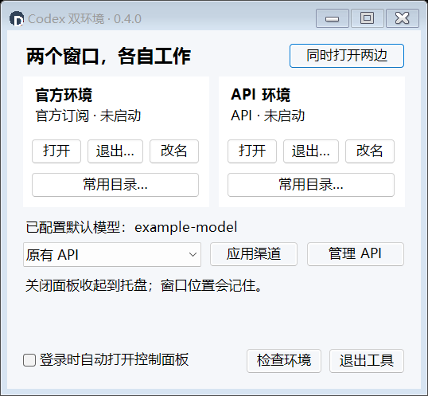
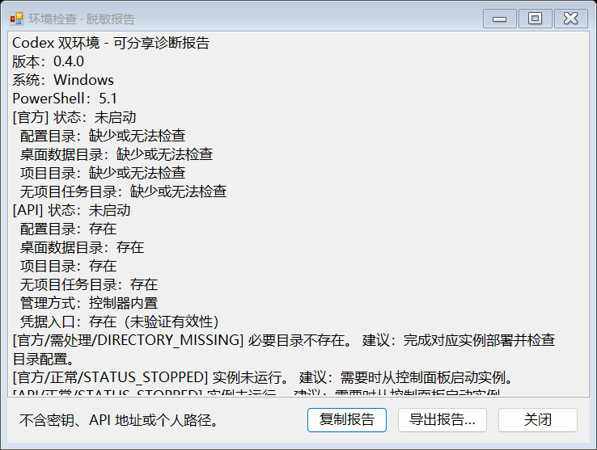

# 0.4：让两个 Desktop 更容易一起使用

两个 Desktop 面板同时存在且独立，可分别接入渠道以及分工。0.4 保留原有配置与实例识别规则，集中改善每天打开、找目录和排障的操作。

## 同时打开两边

面板右上角和托盘菜单均有“同时打开两边”。按官方、API 顺序逐一核验并打开：已经运行时找回原窗口，未运行时才启动。每个环境仍使用原有身份检查与操作锁。

一边失败后继续处理另一边，最终分别反馈结果；错误详情保留原始失败信息。多个主窗口时仍需要选择。取消选窗不会结束实例，也不会阻止另一边打开。Windows 拒绝前台切换时提示点击任务栏，不声称已成功切到前台。启动期间会等待进程和窗口确认，这不是同时派发任务的功能。

## 常用目录

每个环境卡片新增“常用目录…”：

- 项目目录：控制器为该环境登记的项目根目录，不是 Desktop 当前选中项目。
- 无项目任务目录：读取该环境实际 desktop 配置；官方继承模式也支持。
- 配置目录：该环境的 CODEX_HOME。

缺目录、配置与实际无项目目录不符、无法安全解析或存在目录链接时会提示检查，不猜测、不创建目录。此入口仅打开资源管理器，不自动导入项目。

## 脱敏环境检查

“检查环境”展示当前控制器版本、PowerShell 运行时、实例状态、目录是否存在、API 管理方式及凭据入口检查结果，并给出固定建议。

可点击“复制报告”或“导出报告…”交给维护者。报告按固定字段生成，不包含个人路径、自定义环境名称、API 地址、模型、密钥、原始异常、进程命令行或窗口标题。导出为 UTF-8 文本，要求使用新文件名，不覆盖已有文件。

只在本机读取必要配置和进程证据，不请求 API，不解密凭据。因此“凭据入口存在”不能证明密钥有效；“运行中”不能证明任务空闲、请求成功或历史隔离。诊断是打开对话框时的快照，需要最新结果时关闭后重新检查。

## 升级

将 0.4.0 完整包或升级包解压到新目录，退出旧控制器后运行 Start.cmd。两套 Codex 可以继续运行。沿用自动识别、备份和回滚流程，保留名称、渠道配置、凭据和用户数据。参见 [升级指南](UPGRADE.md)。

诊断截图来自隔离测试配置，示例展示官方目录未部署时的提示。
