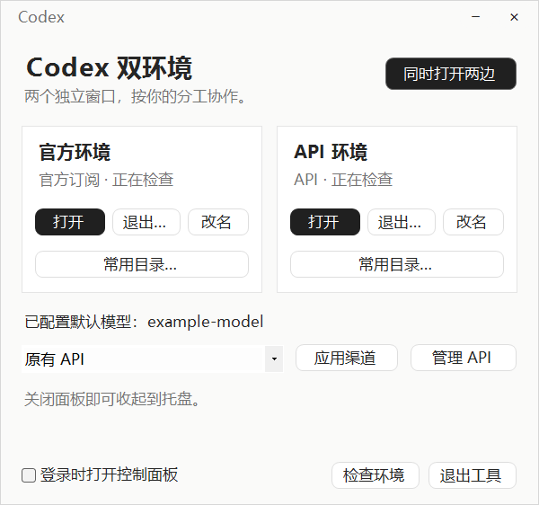
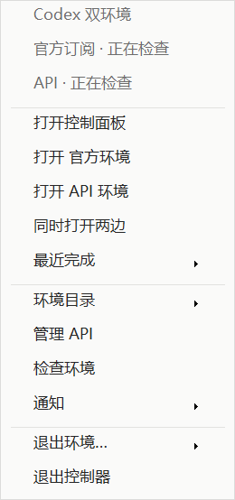

# 0.5.0 · 界面与操作响应

两个 Codex Desktop 窗口同时存在、各自配置与分工。0.5 聚焦日常控制器的外观与操作响应。

## 界面

- 主窗口使用暖白背景、中性色、轻边界和黑色主按钮，拉开标题、状态与操作的层级。
- 自定义标题栏与内容区统一；支持拖动、最小化、恢复以及关闭收起到托盘。任务栏仍使用正常窗口标题和图标。
- 两个环境保留独立的打开、退出、改名和目录入口；渠道操作集中在下方。
- 渠道管理、改名、环境检查与通知卡片沿用一致的按钮与中性色。

## 右键菜单与完成提示

- 托盘和目录菜单统一使用暖白、灰色悬停与轻分隔线；保留键盘导航、勾选和子菜单。
- 托盘提供两端打开、环境目录、API管理、环境检查、最近完成任务，以及通知暂停15/60分钟、恢复、关闭全部提示和安全退出入口。
- 完成卡片使用无系统标题栏的统一样式，可查看任务、关闭、暂停；15秒后自动收起，鼠标停留或获得焦点时保留。
- 本次控制器运行期间保留最近20个完成任务，按任务合并；暂停期间仍入最近记录但不弹窗，暂停时间持久化，到期后新通知自动恢复。重新启动控制器不会重放最近列表。
- 标题仅尝试从对应环境的索引尾部256KiB读取；缺失、不可读或格式不匹配则显示“任务已完成”，不从答案正文或首条用户消息提取标题。

## 任务定位的实际范围

“查看任务”将任务ID与发出通知的环境绑定。当前安装版本支持的路径使用目标可执行文件、目标CODEX_HOME及已核验的CODEX_ELECTRON_USER_DATA_PATH发送 `codex://threads/<UUID>`，不调用全局协议处理器。无法确认目标入口或Electron目录时只找回对应端，显示降级说明。

已完成源码静态核验、35项导航专项和隔离编译宿主的点击/降级测试；**尚未完成真实官方/API双实例点击并确认任务页面的端到端验收**。界面显示“已发送任务定位请求”不等于应用已确认打开任务。具体实现依据见 [任务链接核验](TASK-LINKS-0.5.md)。只处理当前监听到的本地任务，不承诺远程host路由、任务已删除时的定位或系统原生通知分流。

## 操作响应

- 状态探测在独立后台 runspace 中执行。面板和托盘读取最近一次结果，不再等待进程枚举才显示。首轮结果尚未返回时明确显示“正在检查”，读取失败显示“状态未知”。
- 打开/找回窗口的启动和等待转到后台；立即显示进度，冲突操作暂时不可用，面板仍可拖动、最小化和收起。操作结束后恢复按钮并请求刷新状态。
- “检查环境”先显示窗口，再生成报告；报告完成前禁用复制、导出，关闭窗口不必等待查询完成。
- 面板唤起事件和后台结果每 50 ms 检查一次，状态查询与通知仍按各自较低频率执行。
- 已可见的 Store 窗口不再发起二次启动；启动/激活轮询改为先检查、再等待，去掉首轮固定 300/250 ms 等待。仍保留进程路径、启动时间和环境归属核验。

## 使用与边界

使用完整包或升级包中的 `Start.cmd` 自动识别安装；如提示控制器运行，请只退出控制器，再执行升级。两个 Codex 窗口可继续运行。原配置、凭据和回退快照按原升级机制保留。

本次改善的是控制器交互与等待期间的响应。真实 Codex 冷启动、Store 原生唤起、操作系统调度和模型回复时间不由控制器决定。50 ms 是检查间隔，不是端到端响应承诺；状态展示是快照，进程操作仍进行重新核验。

API 配置写入、备份恢复和安全退出的部分准备步骤仍按原保护逻辑执行；不宣称所有 I/O 操作均恒定耗时。尚未验证多显示器混合 DPI、屏幕阅读器和真实 Codex 冷启动延迟分布。

构建与测试证据见 [VALIDATION.md](VALIDATION.md)。本轮开发交付不等于 GitHub 已发布或日常安装已替换。
