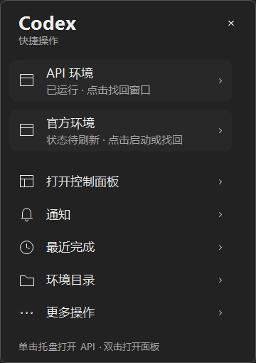
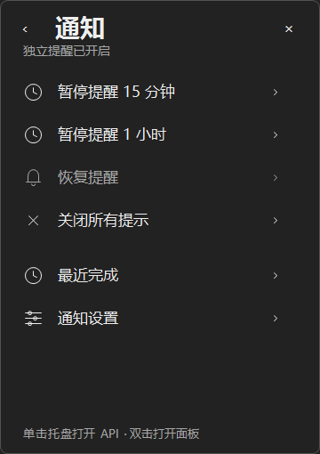
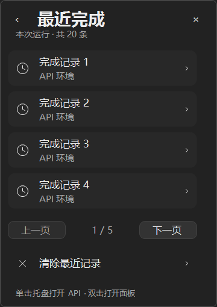

# 0.6.1 · 托盘快捷面板

右键控制器托盘图标会打开专门设计的深色快捷面板，替代原来绑定在托盘上的 Windows ContextMenuStrip。左键单击 API、双击主面板的625ms默认仲裁保留。

## 交互

- 首页：两个独立环境及缓存状态、控制面板、通知、最近完成、环境目录、更多操作。
- 通知、目录、更多功能在同一个窗口内切换；完成记录每页4条，最多沿用现有20条运行期历史。
- 打开时仅读取内存中的配置名称、状态和历史，不执行进程查询或文件读取。既有后台状态工作完成后更新环境状态。
- 右键按下取消待处理单击，右键释放显示面板。普通动作先Hide再进入既有控制流程；打开实例仍由后台工作执行。
- 后台繁忙时环境操作被禁用，并有第二层命令检查，面板入口和页面导航仍可用。
- 通知开关位于主面板“偏好设置”，快捷面板保留暂停、恢复、关闭提示及最近完成。

## 窗口行为

- 单实例复用，隐藏不会销毁；用户关闭、Alt+F4、Esc或失焦收起。
- 默认360×510，定位依据本次点击所在屏幕的WorkingArea；边缘自动翻转并夹紧，支持负坐标工作区。
- 工作区不足时限制窗口尺寸；回到更大工作区恢复请求尺寸。页切换不改位置或尺寸。
- Tab/Shift+Tab/上下键选择可用按钮，Enter执行；不安装全局鼠标键盘钩子。
- 关闭控制器时显式Dispose，不留下第二个常驻进程。

## 验证边界

专项测试覆盖28项容器行为和17项命令集成，包括真实WinForms消息循环、同进程另一窗口激活后的失焦收起、模拟后台慢任务、重复打开、页切换、准确的环境/任务/目录路由、后台繁忙防重入、分页和无渲染I/O。

四角、负坐标和小工作区使用传入工作区矩形验证；不能据此宣称已经完成真实混合DPI双屏验收。右键接线另由Controller烟测实际NotifyIcon事件验证；实际Windows Shell托盘手工操作仍待本机启用后确认。原有真实双端任务直达限制保留。

## 预览

以下截图使用隔离测试数据。

