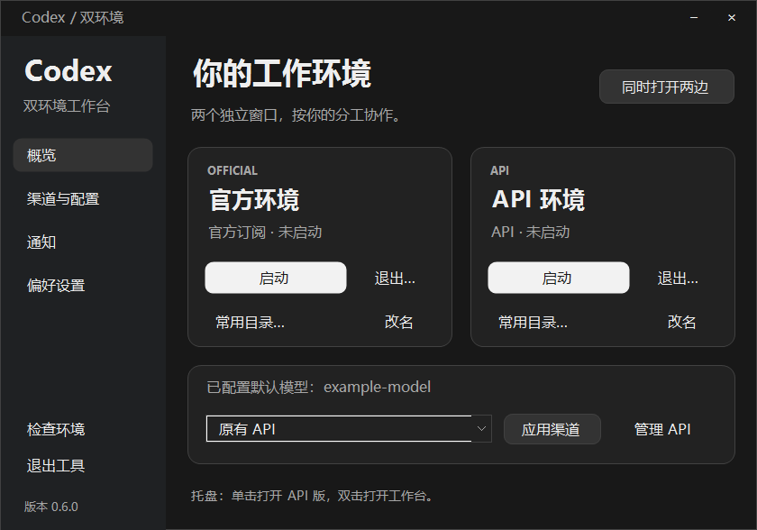
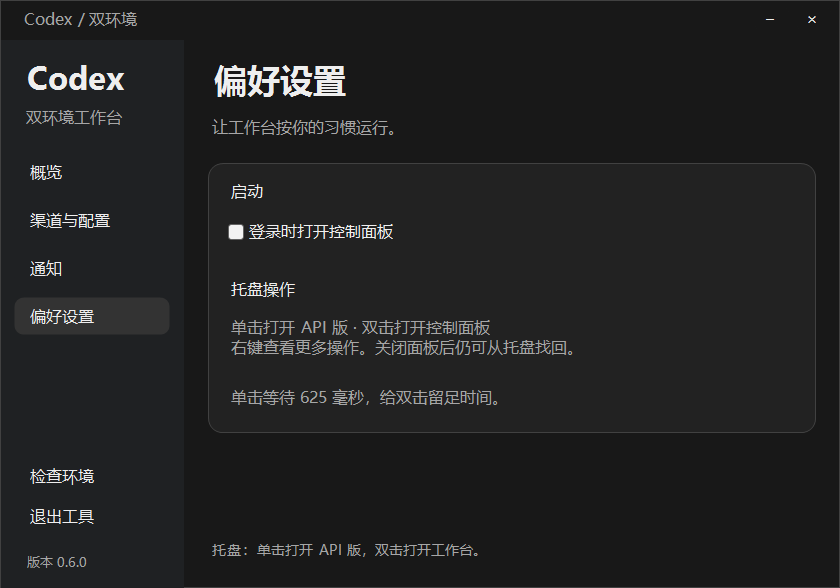
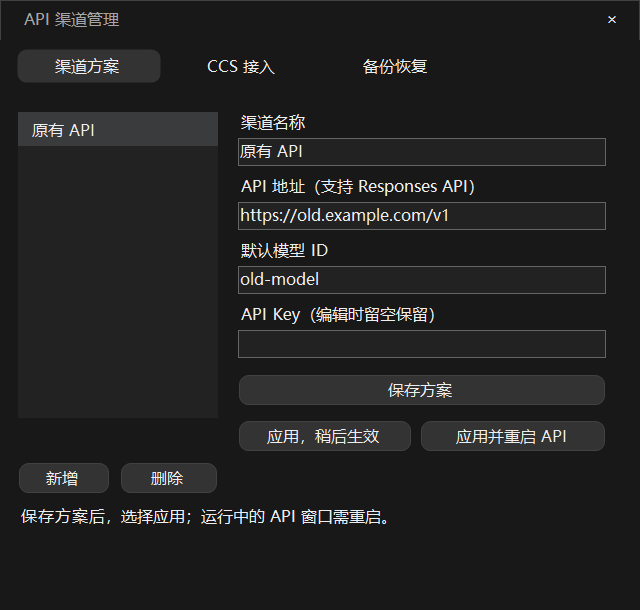
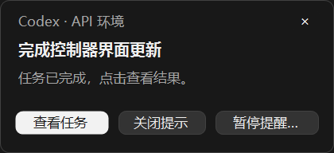

# 0.6.0 · 深色工作台与托盘交互

## 设计

参考本机 Codex 实际深色界面：低对比度侧栏、深灰内容区、细边框、圆角容器与克制的主按钮。保留两个独立 Desktop 的定位与现有控制逻辑。

- 概览保留两个环境卡片和 API 渠道摘要；主按钮根据进程状态显示“启动”或“显示窗口”。
- 侧栏提供概览、渠道与配置、通知、偏好设置、环境检查和退出。
- 自启动移入偏好设置。该页明确解释托盘操作与实际等待时间。
- 主面板、菜单、独立完成提示和配置/诊断窗口统一深色。系统文件选择和危险操作确认仍使用 Windows 原生对话框。
- 打开实例的等待继续使用后台工作，窗口的最小化和关闭到托盘保持可用。

## 托盘

- 单击左键：等待判定结束后启动或找回 API 环境，不打开控制面板。
- 双击左键：只打开或恢复控制面板，不触发第一下对应的 API 操作。
- 判定时间：`max(Windows 系统双击时间, 550ms) + 75ms`，通常为 625ms；保留用户设置的更长系统间隔。
- 右键取消尚未触发的单击，再显示原快捷菜单。退出控制器会释放计时器，避免延迟动作。
- 只订阅 NotifyIcon.MouseDown：原生双击也包含第二次 MouseDown，避免同时绑定 MouseDoubleClick 造成重复。
- 超过间隔的两次点击按两次单击处理；忙碌期间沿用原防重入机制。

实现为 WinForms UI 计时器与单调时钟，不 sleep 阻塞主线程。系统繁忙时回调可能晚于阈值，625ms 不是响应耗时保证。任务栏或桌面快捷方式仍打开面板；本次改动特指控制器托盘图标。

## 验证与边界

实际验证记录见本轮交接文档。托盘行为需覆盖临界双击、延迟单击、右键取消、释放与真正消息循环；面板需覆盖设置切换、通知菜单、编译宿主和安装包。

不改变 Codex 自身聊天界面或 Windows 原生通知。本轮不会发布 GitHub Release。真实任务直达、混合 DPI 和屏幕阅读器的既有未验收范围继续保留。

## 界面预览

以下均为隔离测试数据渲染，不含实际渠道或密钥。

