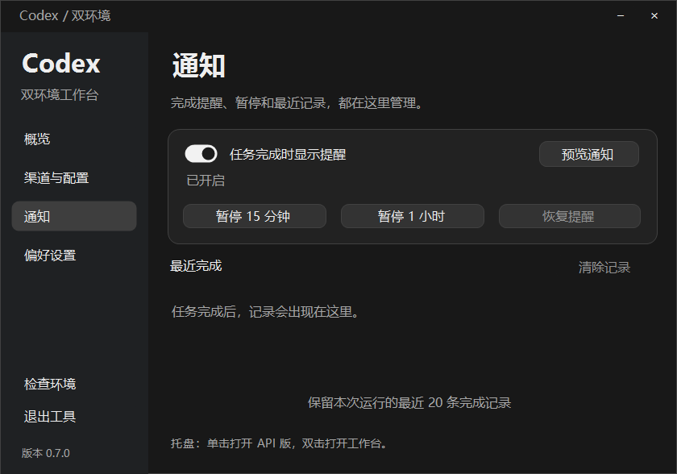
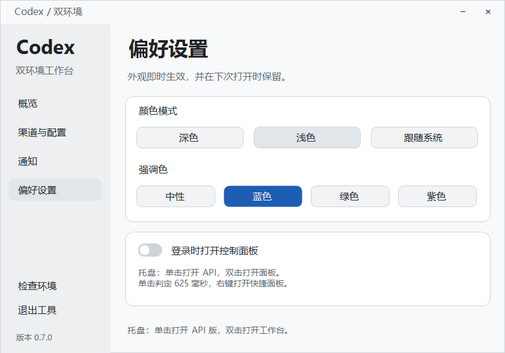
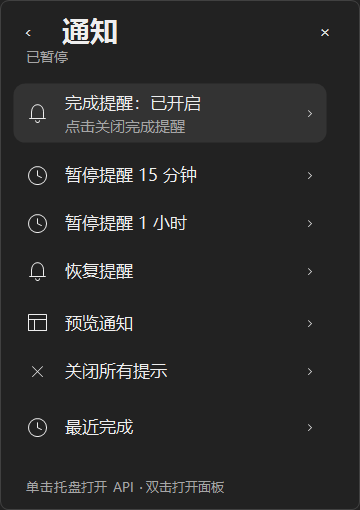
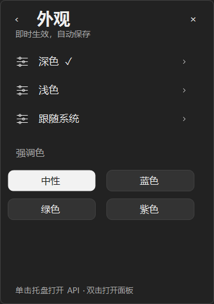

# 0.7.0 · 通知与外观体验

**版本上传不连续：** 公开发布从 v0.5.0 跳至 v0.7.0，0.6.x 为本地迭代版本，未单独上传。本次 0.7.0 累计包含这些版本的改动。

## 通知直接操作

- 侧栏“通知”进入独立通知页，集中提供完成提醒开关、当前状态、暂停15分钟/1小时、恢复、预览和最近完成。
- 托盘通知页也有直接开关；暂停、恢复、清除等操作留在当前页显示结果，不再把“通知设置”跳到通用偏好页。
- 返回遵循实际访问路径：从通知进入最近完成后，返回仍回到通知。目录和外观页保持同窗口导航。
- 最近完成保留现有的本次运行20条上限，主界面记录标注来源环境，清空状态说明清楚。
- 通知预览是独立样例卡片：不覆盖真实任务通知，不加入历史，不启动Codex或打开任务。

## 外观

- 偏好设置提供深色、浅色、跟随系统；强调色可选中性、蓝、绿、紫。
- 托盘“更多操作 → 外观”可直接切换，设置即时生效并自动保存在控制器偏好中。
- 自绘主面板、侧栏、按钮、配置窗口、右键快捷面板与通知卡片同步主题；新显示的窗口使用当前主题。
- 默认仍为深色+中性，保留原体验。跟随系统读取Windows应用亮暗设置，并响应系统主题变化。
- Windows原生文件选择及危险操作确认继续使用系统界面；本版本不修改Codex自身主题或系统主题。

## 响应与失败恢复

通知开关先保存设置，再异步请求旧worker退出；旧worker退完才按最新开关状态启动新worker。快速切换不会同时派生多个worker。超时只清理本控制器创建的worker。保存失败不改变原worker或内存设置；排队启动失败显示“监听已停止”，不会每秒反复启动，也不会把异常抛出UI计时器。

本版保留0.6.3的隐藏窗口原生唤起，以及单击API/双击面板的625ms默认判定。

## 验证

首轮完整23个套件通过；最终导航补丁的快捷面板20项、最终深浅色页面烟测通过。新增外观15项、通知开关/失败恢复20项通过；编译宿主实际按钮检查40项覆盖外观保存、通知直达、预览及后台开关响应。升级包和本机部署证据以dist/HANDOFF-0.7.0.md为准。

## 截图

使用隔离测试数据。

